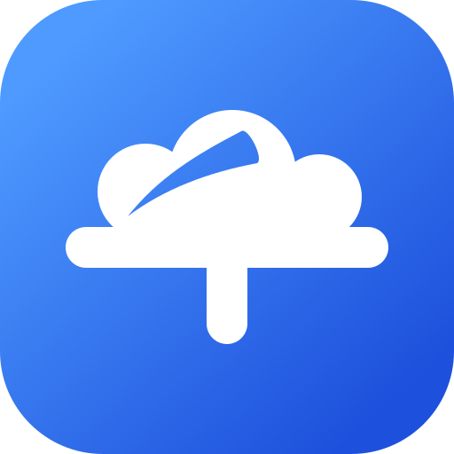

<p align="center">
  
</p>

<h1 align="center">千度网盘 · CendoDrive</h1>

<p align="center">
  Cendo 谐音千度，仿照百度网盘的一个web App
  <br>
  Vue 3 前端 + Spring Boot API，文件内容存储于 FastDFS。
</p>

## 产品一览

CendoDrive 面向个人文件的上传、归类和管理。前端提供文件列表及文件夹视图；后端负责身份校验、文件元数据、存储读写与回收站操作。目前仍处于开发阶段，已支持限时分享及跨用户独立转存。

| 能力       | 当前实现                                           |
| ---------- | -------------------------------------------------- |
| 账号与会话 | 注册、登录、查询当前用户、退出；Redis 管理登录状态 |
| 文件整理   | 按目录浏览、新建文件夹、重命名和移动               |
| 文件传输   | 上传至 FastDFS、经鉴权下载；单文件上限 100 MB      |
| 回收站     | 移入、恢复、永久删除和清空                         |
| 分享       | Redis TTL 限时链接、匿名下载、撤销和登录后独立转存 |
| 扣扣AI     | 配置模型后的多轮智能对话、Markdown 回答与临时历史 |
| 千度AI     | 文件内容智能搜索的模式入口；索引与向量检索待实现 |

## 它如何工作

```text
浏览器（Vue 3）
    │  /api 请求、Bearer Token
    ▼
Spring Boot API
    ├── 认证与会话 ───── Redis
    ├── 用户和文件元数据 ─ MySQL / Flyway
    └── 文件上传与下载 ── FastDFS tracker + storage
```

文件接口和分享管理按登录用户隔离数据；上传后元数据写入 MySQL，文件内容存入 FastDFS。下载经后端鉴权，不直接向浏览器公开存储服务地址。历史本地存储文件保留读取兼容。

## 快速开始

需要 **Docker Compose**。一键构建并启动前端、后端、MySQL `cendo`、Redis、FastDFS tracker 和三个 storage：

```sh
docker compose up -d --build
# 如端口已被现有容器占用，请先停止现有容器；不要删除原有数据卷。
```

打开 `http://localhost`（仅本机可访问）；后端 API 位于 `http://localhost:8080`，Compose 前端使用 Vite Preview 将 `/api/` 代理至后端，无需配置 Nginx（仅用于本机开发）。Compose 端口仅绑定宿主机回环地址；MySQL 开发账号为 `cendo` / `cendo_dev_password`。可在启动前通过 `MYSQL_PASSWORD`、`MYSQL_ROOT_PASSWORD` 环境变量覆盖，后端自动使用相同的 MySQL 密码。数据存放在 Compose 命名卷；`docker compose down` 不删除数据，**不要执行 `down -v`**。更新代码后运行 `docker compose up -d --build`。已有独立容器占用端口时先停止旧容器，注意新命名卷不会自动迁移旧数据。

```sh
# 可选：在宿主机分别开发时，需 Java 21、Maven、Node.js/npm；只启动依赖：
# docker compose up -d mysql redis tracker storage1 storage2 storage3
# 终端 1：后端
cd backend
cp src/main/resources/application.example.yml src/main/resources/application.yml
# 示例默认 DB_USER=cendo、REDIS_HOST=localhost、FASTDFS_TRACKER=localhost:22122
# Compose 默认密码需同步设置；也可编辑本地 application.yml
DB_PASSWORD=cendo_dev_password mvn spring-boot:run
# 若已在 application.yml 设置密码，则直接运行 mvn spring-boot:run
```

```sh
# 终端 2：前端（从仓库根目录执行）
cd frontend
npm ci
npm run dev
```

打开 `http://localhost:5173`；后端默认监听 `http://localhost:8080`。开发服务器默认把 `/api` 代理到后端 8080；如需调整，设置 `VITE_API_PROXY_TARGET`。不要将密码或 Token 放入 `VITE_*` 环境变量，它们会暴露在浏览器中。本地配置文件不要提交到仓库。

> [!NOTE]
> Compose 面向本机开发，不提供生产级 HTTPS、访问控制或备份；默认密码不适用于生产。

### 启动前配置扣扣AI

智能对话兼容 **OpenAI Chat Completions** 接口。启动后端前，在仓库根目录的本地 `.env`（已被 Git 忽略）中设置：

```dotenv
CENDO_AI_CHAT_BASE_URL=https://api.openai.com/v1
CENDO_AI_CHAT_MODEL=替换为服务商提供的模型名称
CENDO_AI_CHAT_KEY=替换为你的服务端密钥
```

Compose 会把三项注入后端；配置好后执行 `docker compose up -d --build backend frontend`。本地 Maven 开发时，`.env` **不会自动加载**，请把三项导出为环境变量，或填入本地 `backend/src/main/resources/application.yml` 的 `cendo.ai.chat.base-url/model/key`，再启动后端。修改配置需要重启后端。

- `base-url` 填 API 基础地址（按服务商要求通常含 `/v1`），**不要**填到 `/chat/completions`；后端会自动拼接该路径。生产连接应使用 HTTPS。
- 三项全部留空时，其他功能正常启动，聊天页面明确提示未配置；只填部分配置会阻止后端启动，避免误配置。状态显示“已配置”只代表三项齐全，不代表凭据或模型已验证可用。
- Key 只放后端；不要写进 `VITE_*`、前端代码或提交。请求中的提问与上下文会发送给配置的模型服务商，请先评估隐私和费用；上线前在网关增加用户额度、限流与监控。

登录后通过首页“扣扣AI”进入 `/ai`，点击顶部切换“智能对话 / 千度AI”。对话历史仅保存在当前页面内存，离开或刷新即清空。千度AI 当前仅展示入口与说明，不会上传内容、向量化或发起文件内容搜索；既有异步索引事件机制保持不变。

接口、上下文限制与排错见 [AI 智能对话接口与配置](docs/AI智能对话接口与配置.md)。

### FastDFS 上传空间不足

节点 `ACTIVE` 只说明在线，不保证允许上传。镜像默认预留磁盘的 20%；低于阈值时 SDK 会报 `错误码：28，错误信息：没有足够的存储空间`，即使磁盘仍有空闲。

本地 Compose 默认预留 **5%**，可用 `FDFS_RESERVED_STORAGE_SPACE` 覆盖（整数 `1%`–`99%`，拒绝零预留）。例如设置 `FDFS_RESERVED_STORAGE_SPACE=10%` 后启动。生产环境应根据容量、备份和监控另行选择阈值，不要关闭空间保护。

已有环境应用修改时只需重建 tracker，再重启 storage 获取新策略；不删除数据卷：

```sh
docker compose up -d --no-deps tracker
docker compose restart storage1 storage2 storage3
docker compose exec tracker fdfs_monitor /etc/fdfs/client.conf
```

检查三节点均为 `ACTIVE`，且 `disk available space` 大于待上传文件大小。如果修改了后端鉴权代码，也需重启本机后端（容器部署则重新构建后端），否则仍会运行旧的异步下载逻辑。

## 技术架构

| 层级 | 技术                                                       |
| ---- | ---------------------------------------------------------- |
| Web  | Vue 3、TypeScript、Vite、Vue Router、Axios                 |
| API  | Java 21、Spring Boot 3.3、Spring Security、Spring Data JPA |
| 数据 | MySQL、Flyway、Redis                                       |
| 文件 | FastDFS（兼容读取历史本地文件）                            |
| 测试 | Vitest、JUnit / Spring Boot Test                           |

## 项目结构

```text
cendoDrive/
├── frontend/    Vue 页面、组件与 API 客户端
├── backend/     Spring Boot 接口、业务逻辑与数据库迁移
└── docs/        设计说明、运行记录和接口文档
```

## 接口与质量检查

后端启动后访问 [Swagger UI](http://localhost:8080/swagger-ui/index.html) 或 [OpenAPI JSON](http://localhost:8080/v3/api-docs)。主要接口包括 `/api/auth/*`、`/api/user/me`、`/api/files/*`、`/api/ai/chat`；受保护接口需要 `Authorization: Bearer <token>`。

```sh
(cd backend && mvn test)
(cd frontend && npm test)
(cd frontend && npm run build)
```

需要连接数据库和 Redis 的集成测试配置参见 [后端说明](./backend/README.md)。
